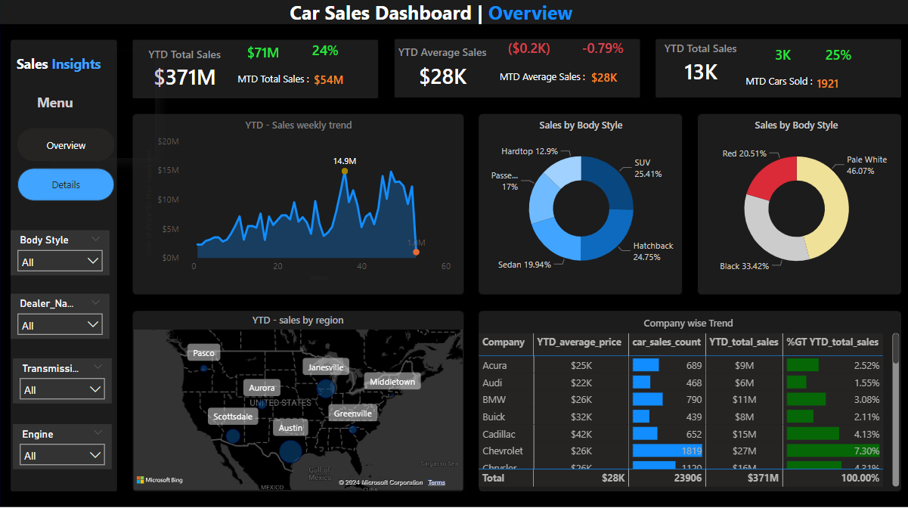
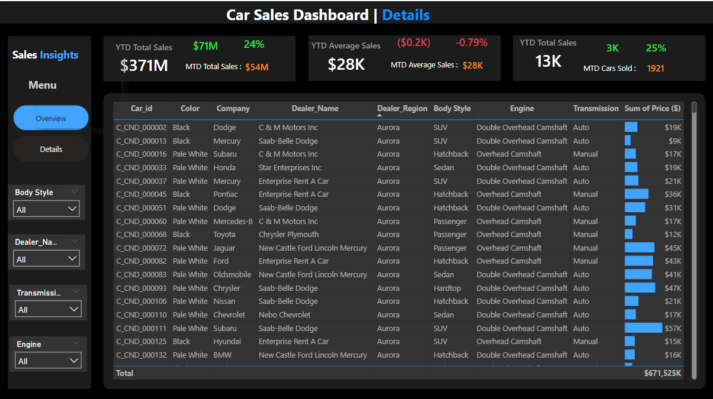
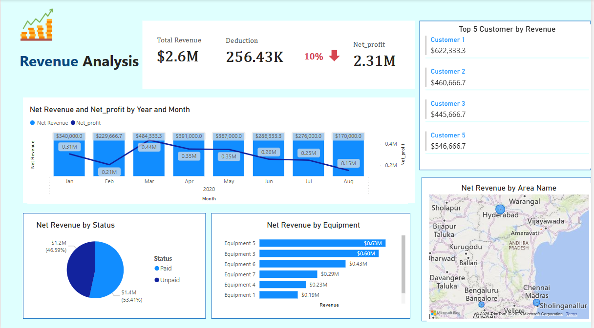
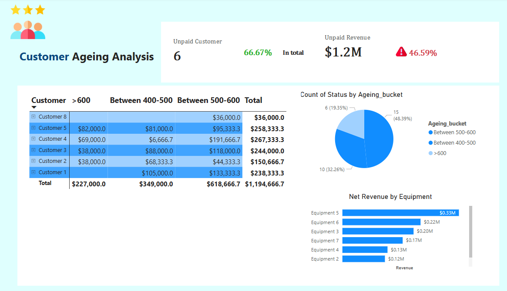
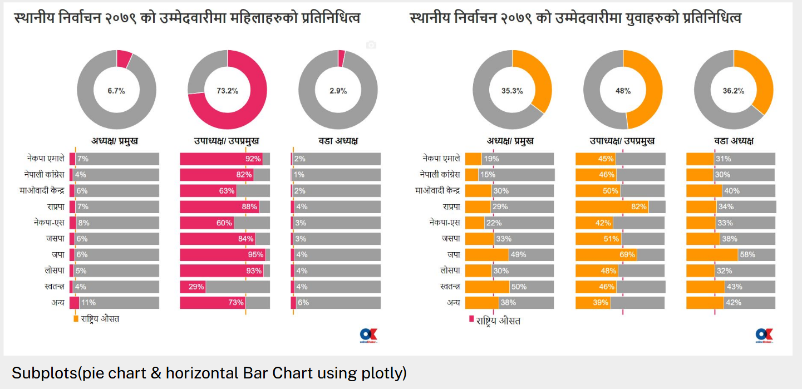
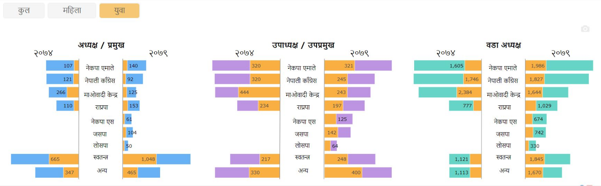
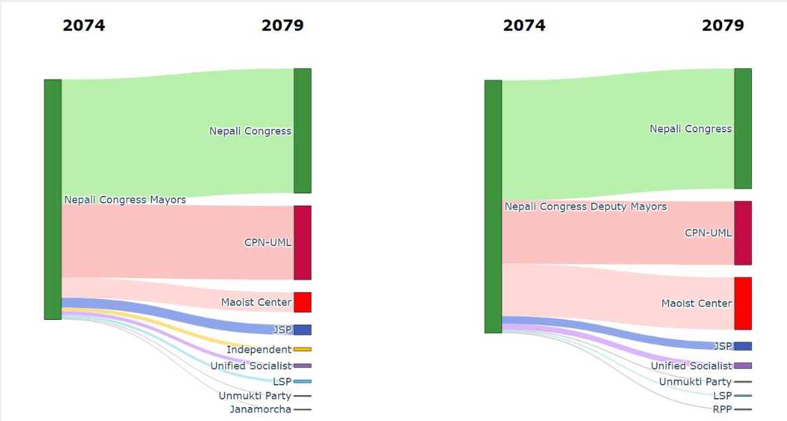

# Karishma's Portfolio
Passionate data enthusiast with a robust background in data and business analytics and a strong interest in using datadriven
insights to tackle real-world challenges.

# 1. Customer Segmentation - ##### <a href="[#the-header](https://github.com/kari-hue/MachineLearningModels/blob/main/Customer%20Segmentation/Customer%20Segmentation%20(1).ipynb)">Link to the project</a>

This is a complete end to end machine learning project accomplished by analyzing a dataset that is based on transaction taken form a UK-based retailer. The dataset is present in [UCI Machine Learning Repository](https://archive.ics.uci.edu/dataset/352/online+retail). The primary objective of the project is to amplify the efficiency of marketing strategies and boost sales through <b>Customer Segmentation</b>. For this purpose,I used the concept of <b>K-Means Clustering</b> algorithm.

## Task accomplished in this project

* <b>Data cleaning & Tranformation</b> : Data cleaning has been done by handling missing values,duplicates, and outliers, preparing it for the effective clustering.
* <b> Feature Engineering </b>: New features has been created based on the transactional data to create a customer-centric dataset, setting the foundation for customer segmentation. For e.g. Calculating recency by using the current date and last purchased date of the customer, calculating seasonality and trends
* <b> Data preprocessing </b>: Undertook feature scaling and dimensionality reduction to streamline the data enhancing the efficiency of the clustering process.
* <b> Customer Segmentation using K-means Clustering</b>: The customers are segmented into distinct groups using K-means, facilitating targeted marketing and personalized strategies.
* <b> Cluster Analysis & Evaluation</b>: Analyze and profile of each cluster to develop targeted markting strategies and assess the quality of the clusters formed.

### Choosing the best cluster using Elbow Method

### Distribution of three clusters

### Profiling the customers

## Inference

We can infer and draw some conclusions about the clusters:

* Cluster 0: From the observation, we can see that the customer belongs to this cluster
-  Tend to do hourly shopping(active during some hrs of the time), frequent buyers 
-  They are low spenders but buy diverse products, and their purchase pattern is also frequent. -impulse buyers

We can quote them as "Hourly buying customers" - Push low-value fast-moving products to lure these customers, increase flash sales or some hourly sale campaign, and target these customers

* Cluster 1: The customer belonging to this cluster
- Are the high spenders, infrequent buyers, who buy diverse products and also have a lot of cancellations
We can address them as Infrequent high spending buyers - try to reduce cancellations, quality control of the products sold, and reminder notifications to make them come back sooner to the platform

* Cluster 3: The customers belonging to this cluster
- Are the low-spending customers the least active ones
We can address them as almost churning customers - Throw reminder notifications on a daily basis, alluring discounts, pushing a variety low low-value products 

# Financial Loan Dashboard
This is a PowerBI project performed on a finance dataset taken from the american household.

* Uses Time Intelligence DAX functions to calculate MTD, YTD values
* Advanced and clear visulizations are used with clean labels and tooltips
* Wide range of filters available in the project

  

  
# Sales Dashboard

# Revenue Dashboard

# Election portal visualization project 
<b>About the project :</b> “Election portal for local election in Nepal” is visualization project whose main aim is to leverage the data collected from the local election 2079 along with the data from the past local election in order to create an interactive dashboard.

<b>Task performed:</b>
* Data collection - Pdfs, web scraping using Beautiful Soup
* Data Analysis - Vote Difference, Gender Wise Analysis, Age wise Analysis, Voteswing
* Data Visualization - Comparison chart, Tables, Sunbrust Chart all using python plotly

 <b> Results </b>
 #### Vote Representation

 #### Genderwise Representation
 

 #### Vote swing Representation

# Coffee Leaf Detection System- project plus report
